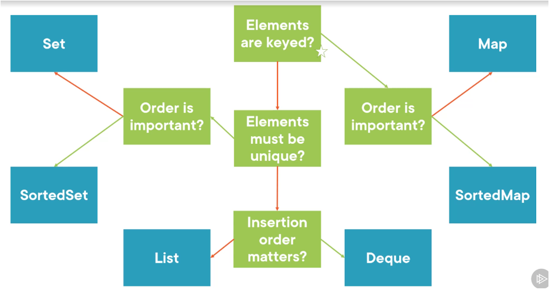

# Collections

Collections refer to data structures that can store objects. The `Collection` interface is the parent of all other interfaces, including Lists, Queue, and Set. Map is not part of the Collection interface but is a part of the Collections framework.

- **Interface and Implementation**: The Collection design includes an interface (e.g., List) and its corresponding implementations (e.g., ArrayList).

- **Interface Functions**: Common methods provided by the Collection interface include `add()`, `remove()`, `size()`, and `contains()`. These methods must be implemented by classes that use the interface.

- **Iterable Interface**: The `Collection` interface extends the `Iterable` interface, which includes the `Iterator` implementation. `Iterator` allows you to loop through a Collection.

# Lists

Lists are ordered collections of values that are indexed numerically. They are a subtype of the Collection interface.

- **List Subtypes**: Examples of List subtypes are `ArrayList`, `LinkedList`, `Vector`, and `Stack`.

- **Index-Based Access**: Each element in a List has an index, which allows for modification using indices.

- **Advantage of ArrayList**: ArrayLists can dynamically resize, unlike regular arrays.

- **Sublist**: The `sublist(inclusive, exclusive)` method returns a portion of the List.

# Maps

Maps are unordered collections of key-value pairs indexed by a key. Unlike Lists, which use numerical indices, Maps use keys to look up values. Map is not part of the Collection interface.

- **Map Interface**: The Map interface includes methods like `get()`, `put()`, `remove()`, and `values()`.

- **Map Implementations**: Some implementations of Map are `HashMap`, `TreeMap`, and `LinkedHashMap`. You can declare a Map to allow switching between implementations.

- **KeySet**: The `keySet()` method returns all keys of the map.

- **Values**: The `values()` method returns all values as a List.

- **Map.EntrySet**: `Map.EntrySet<>` allows you to iterate through a map and use key-value pairs.

- **Map Implementations**: Different Map implementations offer various behaviors: `HashMap` has no guaranteed order, `LinkedHashMap` maintains insertion order, and `TreeMap` sorts keys alphanumerically.

# Sets

Sets are unordered collections of unique values and are a subtype of the Collection interface.

- **Unique Values**: Sets do not allow duplicate values. The `add()` method is overridden to enforce uniqueness.

- **Set Implementations**: Some implementations of Sets are `HashSet`, `TreeSet`, and `EnumSet`.

- **Set Operations**: You can perform operations like finding common elements with `retainAll()` and combining sets with `addAll()` (no duplicates).

- **Sorting**: Sets are easier to sort compared to Lists. You can create a `TreeSet` for automatic sorting.

- **Complex Operations**: For complex set operations, such as union and intersection, consider using Venn diagrams as a visualization tool.

- **Hashcode and Equals**: HashMap and HashSet classes use a hashcode to find an empty slot. This implies that if an object equals another object, both should have the same hashcode and the same slot. 